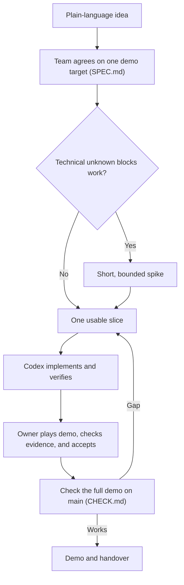

# Just One More — AI-first workflow

Start with a clear outcome, let Codex do the bounded work, and verify what
actually runs. The team decides scope, shared interfaces, and acceptance. Use
**Spec → optional Spike → Slice → Check** for new work; skip documents for a
small fix with a clear expected result.

This repository has an initial [product spec](SPEC.md), workflow instructions,
templates, and executable setup checks. Some scope is agreed; acceptance
criteria and mechanics remain draft where marked. There is no application
stack yet. [QUALITY.md](QUALITY.md) defines verification, current gaps, and
the evidence owners use to accept work without reading source code.

## From idea to demo

## Who chooses the next step?

Codex loads [AGENTS.md](AGENTS.md) for standing repository rules. The
[team-workflow skill](.agents/skills/team-workflow/SKILL.md) explains how to
do a stage; putting `$team-workflow` in your request makes that explicit.
**Your message chooses the stage:** plan, record decisions, run a spike,
propose or implement a slice, or check the integrated result. The schedule
below is a team guide, not an automatic timer. Codex stops after a proposal
for the team's decision; an agreed implementation request includes the work
and its relevant checks without another approval.

Tell Codex the outcome you want, what the team has already agreed, important
boundaries, and how to verify success. For implementation, name the branch and
file ownership. At the first kickoff, the plain-language idea and deadline are
enough; Codex can propose the missing details. [`templates/`](templates/)
contains formats, not product requirements.

- **Spec:** The team picks one user journey, what is in and out, a few
  observable `AC-XX` acceptance criteria, and any shared interfaces. The
  designated engineer asks Codex to record agreed decisions in `SPEC.md`.
- **Spike, only if blocked:** Give one consequential technical question an
  owner, a small experiment, and a timebox. Record evidence in `spikes/`.
  Rebuild useful experimental code in a slice rather than merging it as-is.
- **Slice:** Agree on one runnable outcome, owner, branch, file boundaries,
  and how to verify it. Codex implements and checks that outcome. Use a short
  `slices/` record when coordination or resumption needs one; a small fix can
  be requested and checked directly.
- **Check:** The agent checks implementation and reports evidence. The owner
  plays the walkthrough, accepts the behavior, and decides when to integrate.
  Run the complete demo on `main` and record
  cross-slice results in `CHECK.md`. A passing build alone is not a demo check.

## Our 5–6 hour AI hackathon

A nontechnical idea is enough to start. Bring one or two sentences about the
problem; the team can choose the user, demo journey, and technical approach
during kickoff. Do not write a product spec before those decisions are made.

| Time from start | Focus |
|---|---|
| 0–20 min | Describe the idea. Choose one primary user and one journey to demonstrate. Cut everything that is not needed for that journey. |
| 20–40 min | Agree on 2–4 observable acceptance criteria, scope, and only the interfaces and technical choices needed to begin. One engineer records the short `SPEC.md`; choose the integrator and work branches. |
| After minute 40, until the last hour | Build the smallest complete journey in usable slices. Run each result, review it, and integrate frequently. Use a 15–20 minute spike only when an unknown blocks the next decision. |
| Last 60 min | Freeze new features. Check the exact demo from a fresh start on `main`, fix blockers, rehearse, and note known gaps. |

These are timeboxes, not extra gates. If the team already knows an answer,
move on; tell Codex which stage to do next.

Use this as the first prompt with your current idea:

> $team-workflow We have 5–6 hours. Our plain-language idea is: [idea]. Help
> us choose one primary user and one end-to-end demo journey. Propose what is
> in and out, 2–4 observable acceptance criteria, and only the decisions that
> block building. Suggest the smallest first slice. Keep this a proposal;
> do not edit files or implement yet.

After the team chooses the target, the designated engineer sends a new request
at each handoff:

1. **Record the target:** “`$team-workflow` Write `SPEC.md` from the decisions
   we agreed on. Keep open decisions explicit. Do not implement yet.”
2. **Agree on the first slice:** “`$team-workflow` Propose the smallest runnable
   slice for [AC-ID], with suggested owner, branch, file boundaries, and a
   demo check. Stop at the proposal.”
3. **Build and verify:** “`$team-workflow` Implement the agreed slice on
   [branch]. Run [demo step or check], fix task-related failures, and record
   the observed result. Keep a slice record if we need a handoff.” Repeat for
   the next necessary outcome.
4. **Check the integrated demo:** After acceptance and integration, ask
   “`$team-workflow` Check [AC-IDs] on `main` using the full demo steps and
   record the observed results in `CHECK.md`.”

Keep one coding agent at first. If the team needs parallel coding, give each
agent a separate worktree or clone and explicit file ownership. Share changes
to scope or shared interfaces with the team before adopting them.

## Git and integration

`main` is the integration branch and should stay runnable. Use the engineer's
chosen branch, usually `codex/<task>`, for implementation. Commit directly to
`main` only when the engineer says to. Pull requests are the usual route into
`main`; Codex pushes, opens, or merges them only when asked.

Before reporting a branch ready, fetch `origin/main`. If the branch is behind,
merge `origin/main` into it when existing work can be preserved, then rerun
relevant checks. Never silently stash, reset, overwrite another contributor's
work, force-push, or rewrite shared history. If a conflict affects another
owner's work or an agreed decision, ask the team; report any update blocker.

## Project setup and commands

The setup tools require Git and Python 3.11 or newer, with no extra packages.
Run from the repository root:

| Command | Purpose |
|---|---|
| `python3 scripts/verify.py setup` | Check repository links, AC IDs, configuration, tracked whitespace, and verification-tool regression tests. |
| `python3 scripts/verify.py setup --base origin/main` | Include committed branch changes in whitespace checks after fetching `origin/main`. |
| `python3 scripts/verify.py product` | Run application checks; currently returns **Blocked** (exit 2) because the application does not exist. |
| `python3 scripts/verify.py self-test` | Exercise verification-tool failure handling directly; fails if no tests are found. |

Read `.artifacts/verification/setup/report.md` or
`.artifacts/verification/product/report.md` for the latest results. JSON reports
and command logs are alongside them; generated evidence is Git-ignored.

There are no application install/run/build commands yet. The first application
slice must verify and document them, populate
[verification/commands.json](verification/commands.json), and enable automatic
product CI as described in [QUALITY.md](QUALITY.md#ci-and-integration).
A green **Repository setup** job does not certify the MVP.
