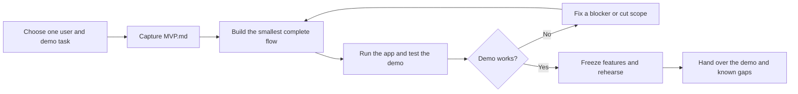

# One-day MVP hackathon

Build one usable experience that can be demonstrated by the end of the day.
The team chooses the user problem and demo; Codex helps turn that into a
working product. Keep the app runnable as the work progresses.

## Workflow

## How to use it

1. **Kick off quickly.** Tell Codex the idea, audience, deadline, and how you
   expect to show it. Choose one core user journey. Capture it in a short
   `MVP.md`: target user, demo steps, what must work, and what is out of scope.
   If a decision blocks the demo, ask about it; otherwise, start building.
2. **Build end to end.** Ask Codex to implement the smallest version of that
   journey, run it, and fix what the demo reveals. Add polish or a second
   feature only after the core flow works. Keep `MVP.md` current when the team
   changes the target.
3. **Finish for the demo.** Reserve the final hour to stop adding features,
   run the exact demo from a clean start, fix blockers, and note known gaps.
   Ask Codex for the commands and steps another person needs to repeat it.

A useful starting prompt is:

> We have one day to build [idea] for [user]. The demo should show [one task].
> Help define the smallest working version in MVP.md, then build and verify it.
> Use the current branch and tell me when a decision would change the demo.

`AGENTS.md` gives Codex the standing rules. `MVP.md` is the one-page product
brief once the team agrees on a target. No separate spec, spike, slice, or
check documents are required. For a narrow fix, ask Codex to make and verify
it directly.

## Working together

One person can work on the current branch. For simultaneous coding, give each
contributor a separate branch or worktree and clear file ownership; integrate
working changes frequently. Review the diff and the running demo before
accepting a change. Push, open a pull request, or merge only when requested.

No app stack is selected yet. Once the team chooses one, add verified install,
run, test, and demo commands here so anyone can reproduce the result.
