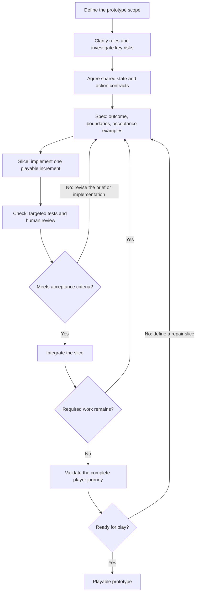

# Spec → Slice → Check

The intended development workflow for **Just One More**: three developers using Codex to build a playable multiplayer prototype within a hackathon day.

**Define a small outcome, implement one playable slice, and check it against agreed behavior. Repeat.**

Humans own scope, game rules, architecture decisions, and acceptance. Codex helps clarify requirements, propose solutions, implement bounded changes, and investigate failures. Focus effort on the two main risks: ambiguous rule interactions and inconsistent multiplayer state.

## Workflow diagram



## Timebox the work

Use a five-hour working plan. If a sixth hour is available, reserve it for integration problems and unfinished validation. Developers work concurrently during implementation; the timeboxes represent elapsed team time.

| Stage           | Time    | Human responsibility                                                                           | Codex contribution                                                        | Exit condition                                                                         |
| --------------- | ------- | ---------------------------------------------------------------------------------------------- | ------------------------------------------------------------------------- | -------------------------------------------------------------------------------------- |
| Define          | 20 min  | Choose the essential player journey, required mechanics, and constraints.                      | Identify ambiguity and propose acceptance examples.                       | A short scope statement and explicit deferred features.                                |
| Investigate     | 30 min  | Choose the riskiest assumptions, resolve rule decisions, and agree interfaces.                 | Explore controlled rule examples and a minimal multiplayer connection.    | Expected rule outcomes are clear; four independent sessions can share a room state.    |
| Build in slices | 150 min | Assign owners, review plans and changes, and accept increments.                                | Implement bounded tasks and run relevant checks.                          | Each integrated slice adds working behavior to the prototype.                          |
| Challenge       | 60 min  | Review expected results independently and exercise failure cases.                              | Check rule boundaries, invalid actions, duplicate commands, and recovery. | Required behavior passes its checks; unresolved blockers have an owner.                |
| Validate        | 40 min  | Freeze optional scope and run the complete player journey on the intended devices and network. | Help reproduce failures and prepare concise startup instructions.         | Players can join, finish a round, compare results, and recover an interrupted session. |

If an investigation exceeds its timebox, make an explicit team decision: simplify the approach, reduce optional scope, or allocate more time. Do not turn an unresolved assumption into an implicit requirement.

## Coordinate three developers

Use three human-owned work streams, each supported by a Codex session.

| Owner       | Responsibility                                                          | Peer review                                                           |
| ----------- | ----------------------------------------------------------------------- | --------------------------------------------------------------------- |
| Developer A | Rules, scoring, special-card effects, and controlled examples.          | Developer B checks state transitions and invalid actions.             |
| Developer B | Rooms, commands, sessions, synchronization, and recovery.               | Developer C checks client-visible state and error handling.           |
| Developer C | Create/join flow, lobby, table, player prompts, and score explanations. | Developer A checks that the interface represents the rules correctly. |

Agree the shared state and action types before splitting dependent work. Assign one owner to shared-contract edits and announce changes before updating dependent code. Use separate branches or checkouts, integrate at slice boundaries, and have a brief team check when an interface changes.

## Repeat the slice loop

Each task needs a short brief containing **the player outcome, relevant rules, allowed files, acceptance examples, and exclusions**. Keep the brief in the task conversation or change description.

1. **Spec:** A developer defines the intended behavior. Codex identifies ambiguity and proposes a small plan. Resolve decisions that affect the result before implementation.
2. **Slice:** Codex implements the smallest usable increment across the necessary layers. The developer keeps the change within its agreed boundaries and reviews the diff.
3. **Check:** Run the relevant tests and inspect the player-facing behavior. A second developer checks expectations against the agreed rules. AI-generated tests must not serve as their own authority for what is correct.
4. **Accept:** Integrate only when the acceptance examples pass and peer review is complete. Record consequential decisions or remaining limitations. On failure, revise the brief or implementation and repeat the check.

Work toward the complete required ruleset through these increments:

| Slice                    | Player outcome                                                                  | Acceptance example                                                                 |
| ------------------------ | ------------------------------------------------------------------------------- | ---------------------------------------------------------------------------------- |
| Meet at a table          | Create, join, ready up, and start with four seats.                              | Every session shows the same roster and settings; only the host can start.         |
| Complete a basic round   | Draw, bank, bust, and see settled scores.                                       | A controlled hand produces the expected score in every client.                     |
| Complete the rules       | Resolve special cards, bonuses, roulette, and both victory modes.               | Fixed card sequences produce the agreed outcomes at rule boundaries.               |
| Recover interrupted play | Refresh or reconnect without losing the seat; reject stale or repeated actions. | Reconnecting restores the player, and repeating a command does not apply it twice. |
| Improve usability        | Make turns, effect prompts, and score breakdowns understandable.                | Another player can complete a round without developer guidance.                    |

Treat accounts, chat, and appearance options as additional scope. Start them only after the required game and recovery path work. Stop optional work when a core check fails or the final validation window begins.

### Example task: a missed prediction

Use a concrete sequence to turn a rule into a checkable task:

- **Spec:** A player holds 4 and 9, predicts 6, and receives 2. All three numbers freeze, including the newly drawn 2, and score zero. A later 4 must still cause a duplicate bust when no Second Chance is held.
- **Slice:** Implement prediction resolution, frozen-card scoring, duplicate detection, and the corresponding public state.
- **Check:** Use a fixed card sequence to assert the frozen hand, zero score, and later bust. Review the visible state to ensure that frozen cards remain in the hand.

The human reviewer checks the expected result against the rule definition before accepting the implementation or its tests.

## Give Codex bounded tasks

Use a reusable task brief rather than a broad request to build the application:

```text
Outcome: [one player-visible behavior]
Context: [relevant rules, interfaces, and existing code]
Allowed changes: [files or component boundaries]
Acceptance examples: [inputs, actions, and expected outcomes]
Outside scope: [features or refactors to leave for another task]

Identify any ambiguity that changes the result and propose a short plan.
Resolve those decisions with the developer, then implement the agreed slice.
Run the relevant checks. Report changed behavior, check results, and remaining
uncertainty. Explain any required expansion of scope before making it.
```

During review, ask Codex to look for counterexamples against the rules and acceptance examples. Have a developer assess the findings and the expected values. Keep implementation and review focused on the same slice.

## Keep acceptance and documentation small

A slice is complete when its agreed examples pass, its diff has been reviewed, and the integrated player flow remains usable. Before calling the prototype ready, check the full journey from joining a table to completing a round, including one interrupted connection. Check the production build and access from the intended devices and network.

Use only a few working artifacts: a short scope statement, agreed rules, shared types, slice briefs, targeted tests, and brief decision notes. Update them when behavior or an interface changes. Add documentation when it resolves a decision or makes a check repeatable.
